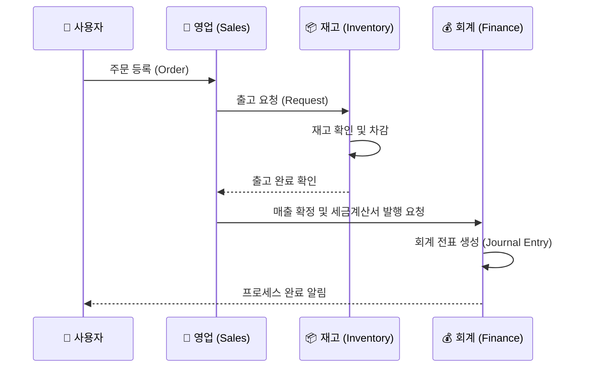

# ERP (Enterprise Resource Planning) System

이 프로젝트는 기업의 전사적 자원 관리를 효율적으로 수행하기 위해 구축된 웹 기반 ERP 시스템입니다. React와 Vite를 사용하여 빠르고 직관적인 사용자 경험을 제공하며, 기업 내 다양한 업무 프로세스를 통합 관리할 수 있도록 설계되었습니다.

## 📋 프로젝트 개요

- **목표**: 기업의 인사, 재무, 물류, 생산 등 핵심 비즈니스 프로세스를 하나의 시스템으로 통합하여 업무 효율성 증대 및 데이터 기반의 의사결정 지원.
- **주요 특징**:
  - 직관적인 UI/UX 대시보드
  - 실시간 데이터 처리 및 리포팅
  - 모듈화된 기능 설계로 확장성 용이

## 🛠 주요 서비스 기능

이 ERP 시스템은 다음과 같은 핵심 모듈을 포함합니다:

### 1. 인사 관리 (HR)
- 직원 정보 등록 및 관리
- 근태 관리 (출퇴근 기록, 휴가 신청 및 승인)
- 급여 관리 및 명세서 조회
- 조직도 및 부서 관리

### 2. 재무/회계 (Finance)
- 매출/매입 관리
- 지출 결의 및 승인 프로세스
- 실시간 재무 상태표 및 손익계산서 조회
- 세금 계산서 발행 및 관리

### 3. 물류/재고 (Inventory)
- 품목 등록 및 카테고리 관리
- 입고/출고 처리 및 재고 현황 실시간 모니터링
- 창고 관리 및 재고 조정
- 발주 요청 및 구매 관리

### 4. 영업/고객 관리 (Sales/CRM)
- 고객사 정보 및 계약 관리
- 견적서 작성 및 주문 처리
- 영업 실적 분석 및 목표 관리

### 5. 시스템 관리 (Admin)
- 사용자 권한 관리 (RBAC)
- 공통 코드 및 메뉴 설정
- 시스템 로그 및 접속 기록 모니터링

## 🔄 주요 업무 프로세스 흐름 (Workflow)

ERP 시스템 내에서 데이터가 어떻게 흐르는지 보여주는 예시입니다. (주문에서 회계 처리까지)



---

## 💻 기술 스택

- **Frontend**: React, Vite
- **Language**: JavaScript / TypeScript
- **State Management**: (예: Redux, Zustand, Recoil 등 사용 시 기재)
- **Styling**: (예: Tailwind CSS, Styled-components 등 사용 시 기재)

---

## 🗄️ 데이터베이스 연동 (MySQL)

이 프로젝트는 보안 및 아키텍처 설계를 위해 React 클라이언트에서 MySQL 데이터베이스에 직접 접속하지 않습니다. 반드시 **백엔드 API 서버**를 통해 데이터를 주고받아야 합니다.

### 1. 시스템 아키텍처

```mermaid
graph LR
    Client[🖥️ Client (React)] -- REST API / JSON --> Server[⚙️ API Server]
    Server -- SQL Query --> DB[(🗄️ Database MySQL)]
    DB -- Result Set --> Server
    Server -- Response --> Client
    
    style Client fill:#61dafb,stroke:#333,stroke-width:2px
    style Server fill:#81c784,stroke:#333,stroke-width:2px
    style DB fill:#ffcc80,stroke:#333,stroke-width:2px
```

### 2. 준비 사항
MySQL 연동을 위해 다음 사항들이 준비되어야 합니다.

1.  **MySQL 서버 설치 및 실행**
    - 로컬 PC 또는 클라우드(AWS RDS 등)에 MySQL 데이터베이스가 실행 중이어야 합니다.
    - ERP 데이터를 저장할 데이터베이스 스키마(Schema)가 생성되어 있어야 합니다.

2.  **백엔드 API 서버 구축**
    - React와 통신할 REST API 서버가 필요합니다.
    - (Node.js 예시) `express` 프레임워크와 `mysql2` 또는 `sequelize`(ORM) 라이브러리를 사용하여 DB와 연결합니다.

3.  **환경 변수 설정 (.env)**
    - 백엔드 서버의 `.env` 파일에 DB 접속 정보를 안전하게 관리해야 합니다.
    ```env
    DB_HOST=localhost
    DB_USER=root
    DB_PASSWORD=your_password
    DB_NAME=erp_db
    DB_PORT=3306
    ```

4.  **Frontend API 호출 설정**
    - React에서는 `axios` 또는 `fetch`를 사용하여 백엔드 API를 호출합니다.
    - 개발 환경에서의 CORS 문제 해결을 위해 `vite.config.js`에 Proxy 설정을 추가하는 것을 권장합니다.

---

## 🚀 설치 및 실행 방법

```bash
# 저장소 클론
git clone [repository-url]

# 의존성 설치
npm install

# 개발 서버 실행
npm run dev
```

---

# React + Vite (Original Template Info)

This template provides a minimal setup to get React working in Vite with HMR and some ESLint rules.

Currently, two official plugins are available:

- [@vitejs/plugin-react](https://github.com/vitejs/vite-plugin-react/blob/main/packages/plugin-react) uses [Babel](https://babeljs.io/) (or [oxc](https://oxc.rs) when used in [rolldown-vite](https://vite.dev/guide/rolldown)) for Fast Refresh
- [@vitejs/plugin-react-swc](https://github.com/vitejs/vite-plugin-react/blob/main/packages/plugin-react-swc) uses [SWC](https://swc.rs/) for Fast Refresh

## React Compiler

The React Compiler is not enabled on this template because of its impact on dev & build performances. To add it, see [this documentation](https://react.dev/learn/react-compiler/installation).

## Expanding the ESLint configuration

If you are developing a production application, we recommend using TypeScript with type-aware lint rules enabled. Check out the [TS template](https://github.com/vitejs/vite/tree/main/packages/create-vite/template-react-ts) for information on how to integrate TypeScript and [`typescript-eslint`](https://typescript-eslint.io) in your project.
