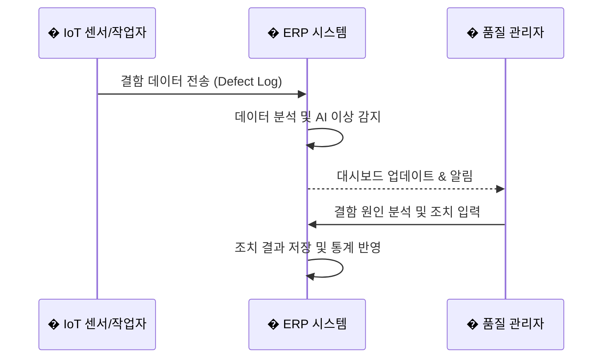

# Hyundai Mobis Cloud ERP (Quality Management System)

이 프로젝트는 현대모비스의 품질 관리(QM) 및 생산 공정 모니터링을 위해 특화된 웹 기반 ERP 시스템입니다. React와 Vite를 기반으로 구축되었으며, 직관적인 대시보드와 실시간 데이터 시각화를 통해 효율적인 품질 관리를 지원합니다.

## 📋 프로젝트 개요

- **목표**: 생산 라인의 품질 데이터 통합 관리, 실시간 공정 모니터링, 그리고 AI 기반의 이상 감지 및 리포팅.
- **주요 특징**:
  - **현대모비스 브랜딩**: 공식 브랜드 컬러(#1D40A3)와 플랫 디자인(Light Theme)을 적용한 전문적인 UI.
  - **실시간 대시보드**: 공정별/설비별 결함 현황, KPI 카드, 트렌드 차트 제공.
  - **공정 히트맵**: 생산 라인의 상태를 직관적으로 파악할 수 있는 시각화 도구.

## 🛠 주요 서비스 기능

### 1. 대시보드 (Dashboard)
- **KPI 카드**: 총 결함 수, 미조치 건수, 조치율, 가동 라인 등 핵심 지표 요약.
- **차트 시각화**: 공정별/설비별 결함 현황, ISO 그룹별 분석, 일별 결함 추세 그래프.
- **공정 히트맵**: 각 공정 라인의 상태(정상/경고/위험)를 색상으로 시각화.

### 2. 기준 정보 관리 (Master Data)
- **BOM 관리**: 자재 명세서(Bill of Materials) 관리.
- **코드 관리**: 결함 코드(Defect Code), 원인 코드(Cause Code) 표준화.
- **설비/공정 관리**: 생산 라인(Process Line) 및 설비(Machine) 정보 등록.
- **품목/LOT 관리**: 생산 품목 및 LOT 추적 관리.

### 3. 품질 관리 (Quality Management)
- **결함 이력 (Defect Logs)**: 실시간 결함 발생 로그 조회 및 필터링.
- **AI 이벤트**: AI가 감지한 이상 징후 리스트 확인.

### 4. 시스템 관리
- 다국어 지원 (한국어/영어).
- 사용자 권한에 따른 데이터 접근 제어.

## 🔄 주요 업무 프로세스 흐름 (Workflow)



---

## 💻 기술 스택

- **Frontend**: React, Vite
- **Styling**: CSS Modules, Tailwind-like Utility Classes (Custom), Lucide React (Icons)
- **Visualization**: Recharts (Charts), Custom Heatmap
- **Deployment**: GitHub Pages

---

## 🗄️ 데이터베이스 연동 (MySQL)

이 프로젝트는 보안 및 아키텍처 설계를 위해 React 클라이언트에서 MySQL 데이터베이스에 직접 접속하지 않습니다. 반드시 **백엔드 API 서버**를 통해 데이터를 주고받아야 합니다.

### 1. 시스템 아키텍처

```mermaid
graph LR
    Client[🖥️ Client (React)] -- REST API / JSON --> Server[⚙️ API Server]
    Server -- SQL Query --> DB[(🗄️ Database MySQL)]
    DB -- Result Set --> Server
    Server -- Response --> Client
    
    style Client fill:#61dafb,stroke:#333,stroke-width:2px
    style Server fill:#81c784,stroke:#333,stroke-width:2px
    style DB fill:#ffcc80,stroke:#333,stroke-width:2px
```

### 2. 준비 사항
MySQL 연동을 위해 다음 사항들이 준비되어야 합니다.

1.  **MySQL 서버 설치 및 실행**
    - 로컬 PC 또는 클라우드(AWS RDS 등)에 MySQL 데이터베이스가 실행 중이어야 합니다.
    - ERP 데이터를 저장할 데이터베이스 스키마(Schema)가 생성되어 있어야 합니다.

2.  **백엔드 API 서버 구축**
    - React와 통신할 REST API 서버가 필요합니다.
    - (Node.js 예시) `express` 프레임워크와 `mysql2` 또는 `sequelize`(ORM) 라이브러리를 사용하여 DB와 연결합니다.

3.  **환경 변수 설정 (.env)**
    - 백엔드 서버의 `.env` 파일에 DB 접속 정보를 안전하게 관리해야 합니다.
    ```env
    DB_HOST=localhost
    DB_USER=root
    DB_PASSWORD=your_password
    DB_NAME=erp_db
    DB_PORT=3306
    ```

4.  **Frontend API 호출 설정**
    - React에서는 `axios` 또는 `fetch`를 사용하여 백엔드 API를 호출합니다.
    - 개발 환경에서의 CORS 문제 해결을 위해 `vite.config.js`에 Proxy 설정을 추가하는 것을 권장합니다.

---

## 🚀 설치 및 실행 방법

```bash
# 저장소 클론
git clone [repository-url]

# 의존성 설치
npm install

# 개발 서버 실행
npm run dev
```

---

# React + Vite (Original Template Info)

This template provides a minimal setup to get React working in Vite with HMR and some ESLint rules.

Currently, two official plugins are available:

- [@vitejs/plugin-react](https://github.com/vitejs/vite-plugin-react/blob/main/packages/plugin-react) uses [Babel](https://babeljs.io/) (or [oxc](https://oxc.rs) when used in [rolldown-vite](https://vite.dev/guide/rolldown)) for Fast Refresh
- [@vitejs/plugin-react-swc](https://github.com/vitejs/vite-plugin-react/blob/main/packages/plugin-react-swc) uses [SWC](https://swc.rs/) for Fast Refresh

## React Compiler

The React Compiler is not enabled on this template because of its impact on dev & build performances. To add it, see [this documentation](https://react.dev/learn/react-compiler/installation).

## Expanding the ESLint configuration

If you are developing a production application, we recommend using TypeScript with type-aware lint rules enabled. Check out the [TS template](https://github.com/vitejs/vite/tree/main/packages/create-vite/template-react-ts) for information on how to integrate TypeScript and [`typescript-eslint`](https://typescript-eslint.io) in your project.
